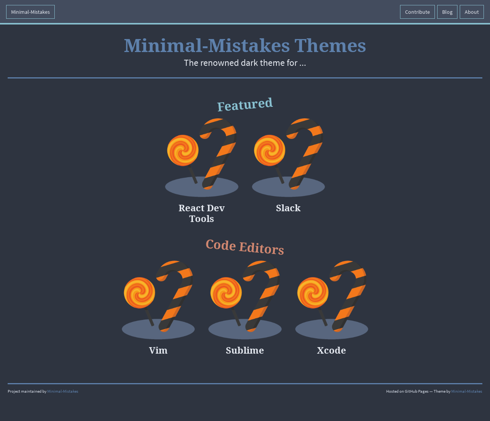

# Homepage for [minimalmistakes.org](https://minimalmistakes.org/)

> This repo contains the source code for [minimalmistakes.org](https://minimalmistakes.org/).

# How it works?

We use [Jekyll](https://jekyllrb.com/), a Ruby framework that does static web page exporting.

## Team

This theme is maintained by the following person(s) and a bunch of [awesome contributors](https://github.com/Minimal-Mistakes/Minimal-Mistakes-Website/graphs/contributors).

 |
--- |
[Minimal-Mistakes](https://github.com/Minimal-Mistakes) |

## License

[GPL-TRC License](./LICENSE)
